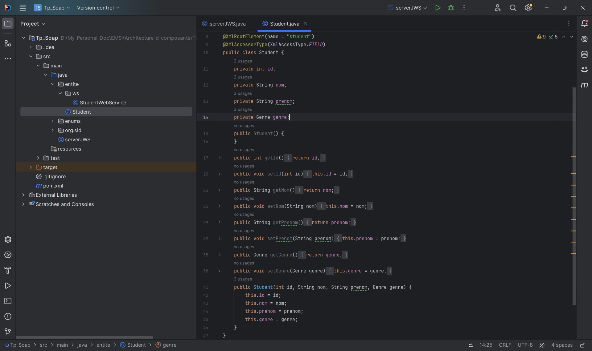

<h2>Compte rendu Tp Soap</h2>
<h3> I. La création du projet Maven :</h3>
<h3>2. Ajout des entités :</h3>

<h3>3. Ajout des dépendances :</h3>

<h3>4. Création du service web (classe Java + annotations) :</h3>

<h3>5. Création et publication du web service :</h3>

<h3>6. Consultation du fichier WSDL :</h3>

<h3>7. Test avec SOAP UI :</h3>

<h3> II. Création de l'application ClientSoap :</h3>
